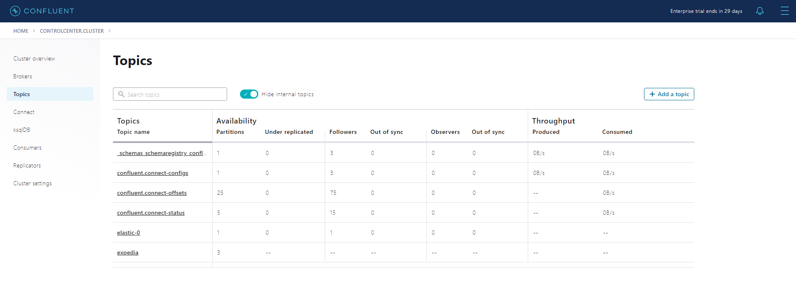

# Installation
```bash
git clone https://github.com/Vlad-Misiukevich/m12_kafkastreams_python_azure.git
```
# Requirements
* Windows OS
* Python 3.8.6
* kubernetes-cli
* azure-cli
* terraform
# Description
1. Login to Azure:  
`az login`

2. Deploy infrastructure with terraform:  
`terraform init`  
`terraform plan -out terraform.plan`  
`terraform apply terraform.plan`

3. Connect to kubernetes cluster:  
```
az aks get-credentials \
    --resource-group rg-vmisiukevich-westeurope \
    --name aks-vmisiukevich-westeurope \
    --subscription 45a58420-2e1a-4ba1-b23b-c55612222ef5
```

4. Run the proxy for Kubernetes API server:  
`kubectl proxy`  

5. Build and push image to DockerHub:  

6. Create the namespace to use:  
`kubectl create namespace confluent` 

7. Set this namespace to default for your Kubernetes context:  
`kubectl config set-context --current --namespace confluent`  

8. Add the Confluent for Kubernetes Helm repository:  
`helm repo add confluentinc https://packages.confluent.io/helm`  
`helm repo update`

9. Install Confluent for Kubernetes:  
`helm upgrade --install confluent-operator confluentinc/confluent-for-kubernetes`

10. Install all Confluent Platform components:  
`kubectl apply -f ./confluent-platform.yaml`

11. Install a sample producer app and topic:  
`kubectl apply -f ./producer-app-data.yaml`

12. Check that everything is deployed:  
`kubectl get pods -o wide`

13. Set up port forwarding to Control Center web UI from local machine:  
`kubectl port-forward controlcenter-0 9021:9021`

14. Browse to Control Center:

15. Create a kafka topic in Control Center:


16. Set up port forwarding to connect cluster from local machine:  
`kubectl port-forward connect-0 8083:8083`

17. Create connector and read data from storage container into Kafka topic:  
`curl.exe -d "@C:\Users\Uladzislau_Misiukevi\PycharmProjects\m12_kafkastreams_python_azure\connectors\azure-
source-cc-expedia.json" -H "Content-Type: application/json" -X POST http://localhost:8083/connectors`


18. Build and push KStream docker image to DockerHub:  
`docker build -t kstream-app .`  
`docker tag kstream-app:latest vmisiukevich/kstream-app:latest`  
`docker push vmisiukevich/kstream-app:latest`
  

19. Create a kafka topic in Control Center:  

20. Run KStream app container in the K8s kluster:  
`kubectl create -f kstream-app.yaml`
  
  

21. Set up port forwarding to connect ksqldb from local machine:  
`kubectl port-forward ksqldb-0 8088:8088`

22. Run KSQL:  
`kubectl run tmp-ksql-cli -i --tty --image confluentinc/cp-ksql-cli:5.4.7 http://ksqldb.confluent.svc.cluster.local:8088`  

23. Create stream in KSQL:  
`create stream hotelviews (hotel_id bigint, stay_category varchar) with (kafka_topic = 'expedia_ext', value_format='json');`

24. Determine initial offset:  
`SET 'auto.offset.reset'='earliest';`

25. Total amount of hotels for each category:  
`select stay_category, count(hotel_id) as hotel_count from hotelviews group by stay_category emit changes;`

26. Total amount of distinct hotels for each category:  
`select stay_category, count_distinct(hotel_id) as hotel_count from hotelviews group by stay_category emit changes;`

27. Create stream for common data visualization in kafka topic:  
`create stream visualization (id bigint, srch_ci varchar, srch_o varchar, hotel_id bigint, date_time varchar, stay_category varchar) with (kafka_topic = 'expedia_ext', value_format='json');`

28. Data visualization in kafka topic with KSQL:  
`select * from visualization emit changes limit 20;`
